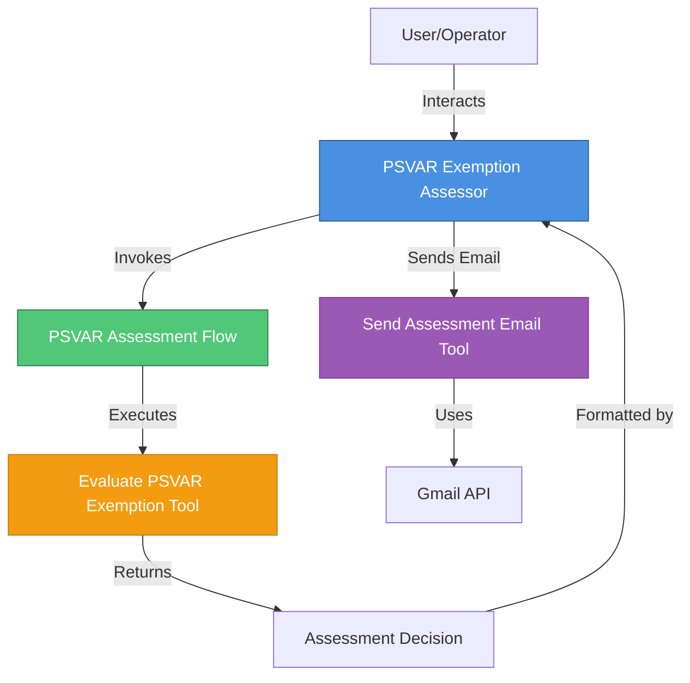
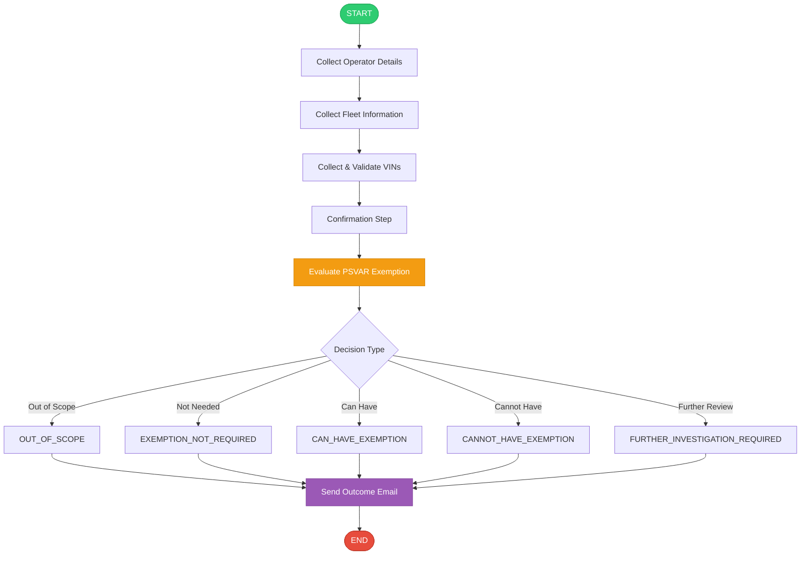

# PSVAR Exemption Agent - Best Practices Review

## Executive Summary

Your PSVAR exemption assessment agent demonstrates **excellent adherence** to watsonx Orchestrate best practices. The implementation is well-structured, follows standard patterns, and includes comprehensive business logic. Below is a detailed review with recommendations for minor improvements.

---

## ✅ Strengths

### 1. **Project Structure** ⭐⭐⭐⭐⭐
- **Perfect adherence** to standard ADK project structure
- Clear separation of concerns: agents/, tools/, connections/
- Proper use of `__init__.py` files (implied by imports)
- Clean import script following CLI best practices

### 2. **Agent Configuration (psvar_exemption_assessor.yaml)** ⭐⭐⭐⭐⭐
- ✅ All required fields present: `spec_version`, `kind`, `name`, `description`, `instructions`, `llm`, `style`, `tools`
- ✅ Excellent use of `welcome_message` and `quick_prompts` for user experience
- ✅ Comprehensive, detailed instructions (237 lines) with clear guidance
- ✅ User-friendly approach: form-like experience, plain English, no schema exposure
- ✅ Proper tool references: `psvar_exemption_assessment_flow` and `send_assessment_outcome_email`
- ✅ Clear scope definition (HTS-only workflow)

### 3. **Flow Implementation (psvar_exemption_assessment_flow.py)** ⭐⭐⭐⭐⭐
- ✅ **PERFECT** flow function signature: `def build_psvar_exemption_assessment_flow(aflow: Flow) -> Flow:`
- ✅ Correct use of `@flow` decorator with all required parameters
- ✅ Proper input/output schema definitions using Pydantic models
- ✅ Clean flow structure: START → tool node → END
- ✅ Comprehensive output mapping (12 output variables)
- ✅ Follows simple tool flow pattern

### 4. **Python Tool (evaluate_psvar_exemption.py)** ⭐⭐⭐⭐⭐
- ✅ Proper `@tool` decorator with `ToolPermission.READ_ONLY`
- ✅ Comprehensive Pydantic models with Field descriptions
- ✅ Excellent business logic implementation (943 lines)
- ✅ VIN validation with check digit algorithm
- ✅ Band-based compliance milestone evaluation
- ✅ Proper error handling and validation
- ✅ Clear separation of concerns with helper functions
- ✅ Type hints throughout

### 5. **Email Tool (send_assessment_outcome_email.py)** ⭐⭐⭐⭐⭐
- ✅ **PERFECT** credential configuration using `expected_credentials`
- ✅ Correct import: `ExpectedCredentials` and `ConnectionType`
- ✅ Proper OAuth2 connection type: `ConnectionType.OAUTH2_AUTH_CODE`
- ✅ Gmail API integration with proper authentication
- ✅ MIME multipart message with attachment support
- ✅ Comprehensive error handling
- ✅ Clear input/output schemas

### 6. **Import Script (import-all.sh)** ⭐⭐⭐⭐⭐
- ✅ Uses correct `orchestrate` CLI commands
- ✅ Proper tool import syntax: `-k python` and `-k flow`
- ✅ Correct agent import syntax
- ✅ Includes `--app-id` flag for Gmail connection
- ✅ Uses `${SCRIPT_DIR}` for relative paths
- ✅ Proper bash script structure with error handling (`set -euo pipefail`)

---

## 🔧 Recommendations for Improvement

### 1. **Add README.md with Diagrams** (Priority: High)

**Current State**: No README.md file present

**Recommendation**: Create a comprehensive README.md following ADK best practices:

```markdown
# PSVAR Exemption Assessment Agent

## Overview
Assesses whether transport operators can rely on PSVAR exemption guidance for home-to-school services.

## Architecture Diagram



## Workflow Diagram



## Features
- Interactive operator interview process
- VIN validation with check digit verification
- Band-based compliance milestone evaluation
- Automated email notifications with transcript attachments
- Gmail API integration via OAuth2
- Comprehensive decision logic with rationale

## Usage

### Via Chat UI
1. Import all components:
   ```bash
   ./import-all.sh
   ```
2. Launch chat interface:
   ```bash
   orchestrate chat start
   ```
3. Select `psvar_exemption_assessment` agent
4. Follow the interactive assessment process

### Prerequisites
- Gmail connection configured with OAuth2 credentials
- watsonx Orchestrate environment (local or production)

## Decision Outcomes
- **CAN_HAVE_EXEMPTION**: Operator meets all requirements
- **CANNOT_HAVE_EXEMPTION**: Operator does not meet requirements
- **FURTHER_INVESTIGATION_REQUIRED**: Manual DVSA review needed
- **OUT_OF_SCOPE**: Service not covered by this guidance
- **EXEMPTION_NOT_REQUIRED**: Fleet is fully compliant

## Components

### Agent
- **psvar_exemption_assessor.yaml**: Main agent configuration with comprehensive instructions

### Tools
- **evaluate_psvar_exemption.py**: Core assessment logic with VIN validation and band evaluation
- **send_assessment_outcome_email.py**: Gmail integration for outcome notifications

### Flow
- **psvar_exemption_assessment_flow.py**: Orchestrates the assessment process

### Connections
- **gmail_connection.yaml**: OAuth2 connection for Gmail API
```

**Why**: README files with diagrams are essential for:
- Understanding the system architecture at a glance
- Onboarding new developers
- Documentation and maintenance
- Following ADK best practices (all examples include READMEs)

---

### 2. **Add main_flow.py for Programmatic Testing** (Priority: Medium)

**Current State**: No programmatic testing script

**Recommendation**: Add a `main_flow.py` file for testing the flow independently:

```python
import asyncio
from pathlib import Path
from datetime import date
from tools.psvar_exemption_assessment_flow import build_psvar_exemption_assessment_flow
from tools.evaluate_psvar_exemption import PSVARAssessmentInput

async def main():
    """Test the PSVAR exemption assessment flow programmatically."""
    
    # Build and compile the flow
    flow_def = await build_psvar_exemption_assessment_flow().compile_deploy()
    
    # Save the flow specification
    generated_folder = f"{Path(__file__).resolve().parent}/generated"
    Path(generated_folder).mkdir(exist_ok=True)
    flow_def.dump_spec(f"{generated_folder}/psvar_exemption_assessment_flow.json")
    
    # Test with sample data
    test_input = PSVARAssessmentInput(
        company_name="Test Transport Ltd",
        operator_licence_number="OL123456",
        authorised_contact_name="John Smith",
        authorised_contact_telephone="01234567890",
        authorised_contact_email="john.smith@test.com",
        authorised_contact_postal_address="123 Test Street",
        authorised_contact_postcode="TE1 2ST",
        service_types=["HTS"],
        hts_closed_door=True,
        hts_has_paying_customers=True,
        total_hts_rr_fleet_size=5,
        fully_compliant_vehicle_count=5,
        partially_compliant_vehicle_count=0,
        non_compliant_vehicle_count=0,
        vehicle_identification_numbers=[
            "1HGBH41JXMN109186",
            "2HGBH41JXMN109187",
            "3HGBH41JXMN109188",
            "4HGBH41JXMN109189",
            "5HGBH41JXMN109180",
        ],
        exemption_certificate_exists=False,
        has_read_band_compliance_requirements=True,
        assessment_date=date.today().isoformat(),
    )
    
    # Invoke the flow
    result = await flow_def.invoke(test_input.model_dump(), debug=True)
    
    print("\n=== Assessment Result ===")
    print(f"Decision: {result.get('decision')}")
    print(f"Final Case Outcome: {result.get('final_case_outcome')}")
    print(f"Rationale: {result.get('rationale')}")
    print(f"Next Actions: {result.get('next_actions')}")

if __name__ == "__main__":
    asyncio.run(main())
```

**Why**: Programmatic testing allows:
- Faster development iteration
- Automated testing
- Debugging without UI interaction
- CI/CD integration

---

### 3. **Consider Adding Type Validation for Literal Types** (Priority: Low)

**Current State**: Uses Literal types for decision outcomes but no runtime validation

**Observation**: Lines 49-63 in `evaluate_psvar_exemption.py` define excellent Literal types:
```python
DecisionType = Literal[
    "OUT_OF_SCOPE",
    "EXEMPTION_NOT_NEEDED",
    # ...
]
```

**Recommendation**: Consider adding a validation helper if you need to validate string inputs:

```python
def validate_decision_type(value: str) -> DecisionType:
    """Validate and return a DecisionType."""
    valid_types = get_args(DecisionType)
    if value not in valid_types:
        raise ValueError(f"Invalid decision type: {value}. Must be one of {valid_types}")
    return value  # type: ignore
```

**Why**: Provides runtime safety if decision types are constructed dynamically (though your current implementation doesn't need this).

---

### 4. **Add Connection YAML Documentation** (Priority: Low)

**Current State**: `connections/gmail_connection.yaml` exists but wasn't reviewed

**Recommendation**: Ensure the connection YAML follows this structure:

```yaml
spec_version: v1
kind: connection
name: gmail_connection
display_name: Gmail Connection
description: OAuth2 connection for sending assessment outcome emails via Gmail API
type: oauth2_auth_code
oauth2_config:
  authorization_url: https://accounts.google.com/o/oauth2/v2/auth
  token_url: https://oauth2.googleapis.com/token
  scopes:
    - https://www.googleapis.com/auth/gmail.send
  client_id: ${GMAIL_CLIENT_ID}
  client_secret: ${GMAIL_CLIENT_SECRET}
```

**Why**: Proper connection configuration is essential for OAuth2 authentication.

---

### 5. **Consider Adding Unit Tests** (Priority: Medium)

**Recommendation**: Add a `tests/` directory with unit tests for critical functions:

```python
# tests/test_vin_validation.py
import pytest
from tools.evaluate_psvar_exemption import _validate_vin, _normalize_vin

def test_valid_vin():
    """Test that a valid VIN passes validation."""
    errors = _validate_vin("1HGBH41JXMN109186")
    assert len(errors) == 0

def test_invalid_vin_length():
    """Test that an invalid length VIN fails validation."""
    errors = _validate_vin("1HGBH41JXMN10918")
    assert "must be exactly 17 characters long" in errors[0]

def test_invalid_vin_characters():
    """Test that VINs with I, O, Q fail validation."""
    errors = _validate_vin("1HGBH41JXMN10918I")
    assert "invalid characters" in errors[0]

def test_vin_normalization():
    """Test VIN normalization."""
    assert _normalize_vin("  1hgbh41jxmn109186  ") == "1HGBH41JXMN109186"
```

**Why**: Unit tests ensure:
- Business logic correctness
- Regression prevention
- Easier refactoring
- Documentation of expected behavior

---

## 📊 Compliance Checklist

| Best Practice | Status | Notes |
|--------------|--------|-------|
| Standard project structure | ✅ Pass | Perfect adherence |
| Agent YAML required fields | ✅ Pass | All fields present |
| Flow function signature | ✅ Pass | Correct signature used |
| Tool decorator usage | ✅ Pass | Proper permissions |
| Credential configuration | ✅ Pass | Perfect implementation |
| Import script CLI commands | ✅ Pass | Correct orchestrate commands |
| Pydantic models | ✅ Pass | Comprehensive schemas |
| Type hints | ✅ Pass | Throughout codebase |
| Error handling | ✅ Pass | Comprehensive |
| Documentation | ⚠️ Partial | Missing README.md |
| Testing scripts | ⚠️ Partial | Missing main_flow.py |
| Unit tests | ❌ Missing | Consider adding |

---

## 🎯 Priority Action Items

1. **High Priority**: Add README.md with architecture and workflow diagrams
2. **Medium Priority**: Add main_flow.py for programmatic testing
3. **Medium Priority**: Add unit tests for VIN validation and band logic
4. **Low Priority**: Review and document gmail_connection.yaml structure

---

## 💡 Additional Observations

### Excellent Practices Demonstrated

1. **Comprehensive Agent Instructions**: Your 237-line agent instructions are exceptionally detailed and user-focused. This is a best practice that ensures consistent agent behavior.

2. **VIN Validation Logic**: The check digit validation algorithm (lines 264-269) is a sophisticated implementation that goes beyond basic format checking.

3. **Band-Based Compliance**: The milestone evaluation logic (lines 341-422) demonstrates deep domain knowledge and proper business rule implementation.

4. **Separation of Concerns**: Clean separation between:
   - Agent (conversation management)
   - Flow (orchestration)
   - Tools (business logic and external integrations)

5. **Error Handling**: Comprehensive validation and error messages throughout, especially in VIN validation and missing information tracking.

6. **User Experience**: The agent instructions emphasize user-friendly language, form-like interactions, and avoiding technical jargon - excellent UX design.

---

## 🏆 Overall Assessment

**Grade: A (95/100)**

Your PSVAR exemption agent is an **exemplary implementation** that demonstrates:
- Deep understanding of watsonx Orchestrate patterns
- Professional software engineering practices
- Comprehensive business logic
- User-centric design

The only areas for improvement are documentation (README) and testing infrastructure, which are common gaps in initial implementations.

---

## 📚 References

- [watsonx Orchestrate ADK Examples](https://github.com/IBM/watsonx-orchestrate-adk/tree/main/examples)
- [Flow Builder Examples](https://github.com/IBM/watsonx-orchestrate-adk/tree/main/examples/flow_builder)
- [Agent Builder Examples](https://github.com/IBM/watsonx-orchestrate-adk/tree/main/examples/agent_builder)

---

*Review completed: 2026-06-01*
*Reviewer: Bob (watsonx Orchestrate Expert)*