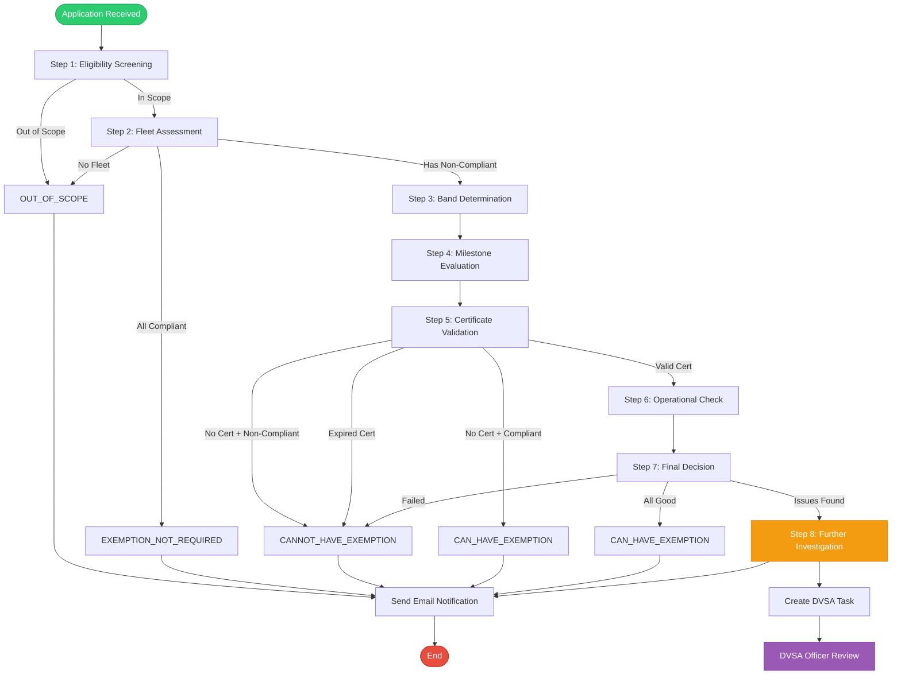

# PSVAR Exemption Assessment - Workflow and Data Requirements

## Document Overview

This document defines the complete workflow for assessing PSVAR (Public Service Vehicles Accessibility Regulations) exemption applications for home-to-school transport services, based on the GOV.UK guidance document.

**Source**: Apply for an exemption from PSVAR accessibility regulations for home-to-school or rail replacement services - GOV.UK

**Last Updated**: 2026-06-01

---

## Executive Summary

The PSVAR exemption assessment workflow determines whether transport operators can rely on exemption guidance for home-to-school (HTS) services. The workflow involves:

1. **Eligibility Screening** - Determine if the service is in scope
2. **Fleet Assessment** - Evaluate fleet composition and compliance levels
3. **Band Determination** - Assign compliance band based on fleet size
4. **Milestone Evaluation** - Check if current compliance meets milestone requirements
5. **Certificate Validation** - Verify exemption certificate validity (if exists)
6. **Operational Compliance** - Check operational conditions are met
7. **Decision Making** - Determine final outcome
8. **Further Investigation** - Route to DVSA officer if needed

---

## Workflow Steps

### Step 1: Eligibility Screening

**Purpose**: Determine if the service qualifies for exemption consideration

**Data Required**:
- Service types (HTS, RR, or both)
- Whether HTS services are "closed-door" (pre-booked, not public)
- Whether HTS services have paying customers

**Decision Logic**:

```
IF service_types does NOT include "HTS"
  → OUT_OF_SCOPE (not eligible for HTS-only workflow)

IF HTS service is NOT closed-door
  → OUT_OF_SCOPE (only closed-door services eligible)

IF HTS service has NO paying customers
  → OUT_OF_SCOPE (services without paying customers not in PSVAR scope)

ELSE
  → PROCEED to Step 2
```

**Outcomes**:
- ✅ **IN SCOPE** - Proceed to fleet assessment
- ❌ **OUT OF SCOPE** - End workflow, notify operator

---

### Step 2: Fleet Assessment

**Purpose**: Collect and validate fleet composition data

**Data Required**:
- Total fleet size (vehicles used for HTS services)
- Number of fully compliant vehicles
- Number of partially compliant vehicles
- Number of non-compliant vehicles
- Vehicle Identification Numbers (VINs) for all vehicles
- VINs for partially compliant vehicles
- VINs for non-compliant vehicles

**Validation Rules**:

1. **Fleet Count Validation**:
   ```
   fully_compliant + partially_compliant + non_compliant = total_fleet_size
   ```

2. **VIN Validation** (for each VIN):
   - Must be exactly 17 characters
   - Must contain only uppercase letters and digits
   - Must NOT contain I, O, or Q
   - Must pass check digit validation (position 9)
   - Must be unique within the fleet

3. **VIN Collection Requirements**:
   - Total VINs provided must equal total_fleet_size
   - Partially compliant VINs must equal partially_compliant_vehicle_count
   - Non-compliant VINs must equal non_compliant_vehicle_count

**Decision Logic**:

```
IF total_fleet_size = 0
  → OUT_OF_SCOPE (no fleet to assess)

IF fully_compliant = total_fleet_size
  → EXEMPTION_NOT_REQUIRED (all vehicles compliant)

IF VIN validation fails
  → FURTHER_INVESTIGATION_REQUIRED (invalid VINs need correction)

ELSE
  → PROCEED to Step 3
```

---

### Step 3: Band Determination

**Purpose**: Assign compliance band based on fleet size

**Band Assignment**:

| Band | Fleet Size | Description |
|------|-----------|-------------|
| **A** | 1-5 vehicles | Small fleet |
| **B** | 6-9 vehicles | Medium-small fleet |
| **C** | 10-29 vehicles | Medium fleet |
| **D** | 30+ vehicles | Large fleet |

**Data Required**:
- Total fleet size

**Decision Logic**:

```
IF fleet_size >= 1 AND fleet_size <= 5
  → Band A

IF fleet_size >= 6 AND fleet_size <= 9
  → Band B

IF fleet_size >= 10 AND fleet_size <= 29
  → Band C

IF fleet_size >= 30
  → Band D
```

---

### Step 4: Milestone Evaluation

**Purpose**: Determine if fleet meets current compliance milestone requirements

**Data Required**:
- Assessment date (current date)
- Band (from Step 3)
- Fleet size
- Number of fully compliant vehicles
- Number of partially compliant vehicles
- Number of non-compliant vehicles

**Milestone Requirements by Band and Date**:

#### Band A (1-5 vehicles)

| Period | Requirement |
|--------|-------------|
| Jul 2022 - Jul 2023 | All vehicles exempt |
| Aug 2023 - Jul 2024 | ≥25% partially compliant |
| Aug 2024 - Jul 2025 | ≥50% partially compliant |
| Aug 2025 - Jul 2026 | ≥1 fully compliant + rest partially compliant |

#### Band B (6-9 vehicles)

| Period | Requirement |
|--------|-------------|
| Jul 2022 - Jul 2023 | All vehicles exempt |
| Aug 2023 - Jul 2024 | ≥25% partially compliant |
| Aug 2024 - Jul 2025 | ≥1 fully compliant + ≥50% partially compliant |
| Aug 2025 - Jul 2026 | ≥2 fully compliant + rest partially compliant |

#### Band C (10-29 vehicles)

| Period | Requirement |
|--------|-------------|
| Jul 2022 - Jul 2023 | All vehicles exempt |
| Aug 2023 - Jul 2024 | ≥25% partially compliant |
| Aug 2024 - Jul 2025 | ≥15% fully compliant + ≥50% partially compliant |
| Aug 2025 - Jul 2026 | ≥25% fully compliant + rest partially compliant |

#### Band D (30+ vehicles)

| Period | Requirement |
|--------|-------------|
| Jul 2022 - Jul 2023 | All vehicles exempt |
| Aug 2023 - Jul 2024 | ≥15% fully compliant + ≥25% partially compliant |
| Aug 2024 - Jul 2025 | ≥25% fully compliant + ≥50% partially compliant |
| Aug 2025 - Jul 2026 | ≥35% fully compliant + rest partially compliant |

**Important Notes**:
- Percentages are always rounded UP (e.g., 1.3 vehicles = 2 vehicles)
- "Rest partially compliant" means all remaining vehicles must be at least partially compliant (no non-compliant vehicles allowed)
- After July 31, 2026, full PSVAR compliance is required (exemption regime expires)

**Decision Logic**:

```
IF assessment_date > 2026-07-31
  → CANNOT_HAVE_EXEMPTION (exemption regime expired)

IF milestone requirements NOT met
  → Record milestone non-compliance
  → PROCEED to Step 5 (may still have valid certificate)

IF milestone requirements met
  → Record milestone compliance
  → PROCEED to Step 5
```

---

### Step 5: Certificate Validation

**Purpose**: Verify if operator has a valid exemption certificate

**Data Required**:
- Does exemption certificate exist? (yes/no)
- Certificate reference number (if exists)
- Certificate start date (if exists)
- Certificate end date (if exists)
- Assessment date

**Decision Logic**:

```
IF exemption_certificate does NOT exist
  IF milestone_compliant = FALSE
    → CANNOT_HAVE_EXEMPTION (no certificate + non-compliant)
  
  IF milestone_compliant = TRUE
    → CAN_HAVE_EXEMPTION (can apply for certificate)
  
  → END workflow

IF exemption_certificate exists
  IF certificate_end_date < assessment_date
    → CANNOT_HAVE_EXEMPTION (certificate expired)
  
  IF assessment_date > 2026-07-31
    → CANNOT_HAVE_EXEMPTION (exemption regime expired)
  
  ELSE
    → Certificate is valid
    → PROCEED to Step 6
```

---

### Step 6: Operational Compliance Check

**Purpose**: Verify operator meets operational conditions of the exemption

**Data Required**:
- Is exemption copy carried onboard each non-compliant vehicle?
- Is alternative accessible transport available?
- Is written confirmation of alternative transport retained?
- Has operator read band compliance requirements?
- Has fleet size changed since exemption granted?
- If fleet size changed, was DfT notified within 5 working days?

**Operational Conditions**:

1. **Exemption Copy Onboard**:
   - A copy of the exemption certificate MUST be carried onboard any vehicle that is not fully PSVAR compliant

2. **Alternative Accessible Transport**:
   - Alternative accessible transport MUST be available for passengers who cannot access exempt vehicles
   - Written confirmation of this arrangement MUST be retained alongside the exemption

3. **Band Compliance Awareness**:
   - Operator MUST confirm they have read their band compliance requirements

4. **Fleet Size Change Notification**:
   - If fleet size changes and causes a band change, operator MUST notify DfT within 5 working days
   - Example: Fleet grows from 5 to 6 vehicles (Band A → Band B)

**Decision Logic**:

```
operational_compliant = TRUE

IF exemption_copy_carried_onboard = FALSE
  → operational_compliant = FALSE
  → Record: "Exemption copy must be carried onboard"

IF alternative_accessible_transport_available = FALSE
  → operational_compliant = FALSE
  → Record: "Alternative accessible transport must be available"

IF written_confirmation_retained = FALSE
  → operational_compliant = FALSE
  → Record: "Written confirmation must be retained"

IF has_read_band_compliance_requirements = FALSE
  → operational_compliant = FALSE
  → Record: "Operator must confirm reading requirements"

IF fleet_size_changed = TRUE
  IF dft_notified_within_5_days = FALSE
    → operational_compliant = FALSE
    → Record: "DfT must be notified within 5 days of band change"

→ PROCEED to Step 7
```

---

### Step 7: Final Decision Making

**Purpose**: Determine final assessment outcome based on all collected data

**Decision Matrix**:

| Scenario | Outcome |
|----------|---------|
| Service not HTS, not closed-door, or no paying customers | **OUT_OF_SCOPE** |
| All vehicles fully compliant | **EXEMPTION_NOT_REQUIRED** |
| No certificate + milestone non-compliant | **CANNOT_HAVE_EXEMPTION** |
| No certificate + milestone compliant | **CAN_HAVE_EXEMPTION** (can apply) |
| Valid certificate + milestone non-compliant | **FURTHER_INVESTIGATION_REQUIRED** |
| Valid certificate + operational non-compliant | **FURTHER_INVESTIGATION_REQUIRED** |
| Valid certificate + milestone compliant + operational compliant | **CAN_HAVE_EXEMPTION** |
| Certificate expired | **CANNOT_HAVE_EXEMPTION** |
| Assessment date after 2026-07-31 | **CANNOT_HAVE_EXEMPTION** |
| Missing critical information | **FURTHER_INVESTIGATION_REQUIRED** |

**Decision Logic**:

```
IF in_scope = FALSE
  → OUT_OF_SCOPE

IF exemption_needed = FALSE
  → EXEMPTION_NOT_REQUIRED

IF valid_certificate = FALSE
  IF milestone_compliant = FALSE
    → CANNOT_HAVE_EXEMPTION
  ELSE
    → CAN_HAVE_EXEMPTION (can apply for certificate)

IF valid_certificate = TRUE
  IF milestone_compliant = FALSE OR operational_compliant = FALSE
    → FURTHER_INVESTIGATION_REQUIRED
  ELSE IF missing_information exists
    → FURTHER_INVESTIGATION_REQUIRED
  ELSE
    → CAN_HAVE_EXEMPTION
```

---

### Step 8: Further Investigation Routing

**Purpose**: Route cases requiring manual review to DVSA officers

**Trigger Conditions**:

Cases are routed for further investigation when:

1. **Missing Critical Information**:
   - Operator licence number not provided
   - Contact details incomplete
   - VIN validation failures
   - Fleet counts don't match declared total
   - Certificate details missing when certificate exists

2. **Compliance Edge Cases**:
   - Valid certificate but milestone non-compliant
   - Valid certificate but operational conditions not met
   - Fleet size changed but notification status unclear

3. **Complex Scenarios**:
   - Multiple validation issues
   - Conflicting information
   - Unusual fleet compositions

**DVSA Task Creation**:

When routing for further investigation, create a task with:

```json
{
  "create_task": true,
  "task_type": "PSVAR_HTS_EXEMPTION_REVIEW",
  "assigned_team": "DVSA Officer",
  "priority": "High",
  "subject": "PSVAR HTS exemption review for [Company Name]",
  "description": "
    Operator: [Company Name]
    Licence: [Operator Licence Number]
    Assessment Date: [Date]
    Outcome: FURTHER_INVESTIGATION_REQUIRED
    
    Rationale:
    - [List all rationale items]
    
    Missing Information:
    - [List all missing information items]
  ",
  "operator_details": {
    "company_name": "...",
    "licence_number": "...",
    "contact_name": "...",
    "contact_email": "..."
  }
}
```

**DVSA Officer Actions**:

The DVSA officer should:

1. **Review All Information**:
   - Verify operator details
   - Check fleet composition
   - Validate VINs against DVLA records
   - Review certificate authenticity

2. **Request Additional Information**:
   - Contact operator for missing details
   - Request supporting documentation
   - Clarify ambiguous responses

3. **Make Final Determination**:
   - Approve exemption
   - Deny exemption
   - Request corrections and re-assessment

4. **Document Decision**:
   - Record rationale
   - Update operator records
   - Issue certificate (if approved)

---

## Complete Data Schema

### Required Data Fields

```json
{
  "company_name": "string (required)",
  "operator_licence_number": "string (required)",
  "authorised_contact_name": "string (required)",
  "authorised_contact_telephone": "string (required)",
  "authorised_contact_email": "string (required)",
  "authorised_contact_postal_address": "string (required)",
  "authorised_contact_postcode": "string (required)",
  
  "service_types": ["HTS"],
  "hts_closed_door": "boolean (required)",
  "hts_has_paying_customers": "boolean (required)",
  
  "total_hts_rr_fleet_size": "integer (required)",
  "fully_compliant_vehicle_count": "integer (required)",
  "partially_compliant_vehicle_count": "integer (required)",
  "non_compliant_vehicle_count": "integer (required)",
  "temporarily_out_of_service_count": "integer (optional, default: 0)",
  
  "vehicle_identification_numbers": ["string (17 chars each)"],
  "partially_compliant_vehicle_identification_numbers": ["string"],
  "non_compliant_vehicle_identification_numbers": ["string"],
  
  "exemption_certificate_exists": "boolean (required)",
  "exemption_certificate_reference": "string (if certificate exists)",
  "exemption_start_date": "YYYY-MM-DD (if certificate exists)",
  "exemption_end_date": "YYYY-MM-DD (if certificate exists)",
  
  "exemption_copy_carried_onboard": "boolean (if certificate exists)",
  "alternative_accessible_transport_available": "boolean (if certificate exists)",
  "written_confirmation_retained": "boolean (if certificate exists)",
  "has_read_band_compliance_requirements": "boolean (if certificate exists)",
  
  "fleet_size_changed": "boolean (if certificate exists)",
  "dft_notified_within_5_days": "boolean (if fleet_size_changed)",
  
  "assessment_date": "YYYY-MM-DD (required)"
}
```

---

## Compliance Definitions

### Fully Compliant Vehicle

A vehicle that complies with **ALL** paragraphs of:

- **Schedule 1**: Facilities for wheelchair users
  - Wheelchair space requirements
  - Ramp specifications
  - Securing mechanisms
  - Priority seating

- **Schedule 3**: Other accessibility features
  - Floors and gangways
  - Seats
  - Steps
  - Handrails
  - Lighting
  - Information systems

### Partially Compliant Vehicle

A vehicle that is **NOT** fully compliant but as a minimum complies with:

- **Schedule 3, Paragraph 2**: Floors and gangways
- **Schedule 3, Paragraph 3**: Seats
- **Schedule 3, Paragraph 4**: Steps (excluding sub-paragraphs 1d, 1e, 1f, and 5)
- **Schedule 3, Paragraph 5**: Handrails

### Non-Compliant Vehicle

A vehicle that does not meet the minimum requirements for partial compliance.

---

## Email Notification Requirements

After assessment completion, send email notification with:

### Email Structure

```
To: [authorised_contact_email]
Subject: PSVAR HTS exemption outcome: [outcome_type]

Dear [authorised_contact_name or company_name],

The outcome of your PSVAR HTS exemption assessment is: [OUTCOME]

Rationale:
- [Rationale point 1]
- [Rationale point 2]
- ...

Next Actions:
- [Action 1]
- [Action 2]
- ...

[If FURTHER_INVESTIGATION_REQUIRED]
A DVSA officer will contact you within [timeframe] to discuss your application.

Best regards,
DVSA PSVAR Assessment Team
```

### Attachment

Include conversation transcript as attachment for operator records.

---

## Key Dates and Deadlines

| Date | Event |
|------|-------|
| **1 July 2022** | Exemptions commence |
| **1 August 2023** | First milestone deadline |
| **1 August 2024** | Second milestone deadline |
| **1 August 2025** | Third milestone deadline |
| **31 July 2026** | Exemption regime expires |
| **1 August 2026** | Full PSVAR compliance required |

---

## Band Change Notification

Operators must notify DfT within **5 working days** if:

1. Fleet size changes
2. The change causes a band change

**Example Band Changes**:
- Fleet grows from 5 to 6 vehicles: Band A → Band B
- Fleet reduces from 10 to 9 vehicles: Band C → Band B
- Fleet grows from 29 to 30 vehicles: Band C → Band D

**Notification Method**: Email to psvar@dft.gov.uk

---

## Workflow Summary Diagram



---

## Implementation Notes

The current implementation in this repository follows this workflow with:

- **`evaluate_psvar_exemption.py`**: Implements Steps 1-7 (decision logic)
- **`psvar_exemption_assessment_flow.py`**: Orchestrates the workflow
- **`send_assessment_outcome_email.py`**: Handles email notifications
- **`psvar_exemption_assessor.yaml`**: Agent that conducts the interview

The workflow is fully automated except for Step 8 (DVSA officer review), which requires manual intervention when `FURTHER_INVESTIGATION_REQUIRED` outcome is reached.

---

*Document Version: 1.0*  
*Last Updated: 2026-06-01*  
*Based on: GOV.UK PSVAR Exemption Guidance (Published 13 April 2022, Updated 11 July 2022)*