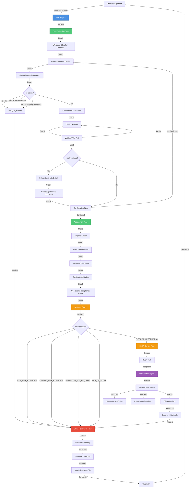
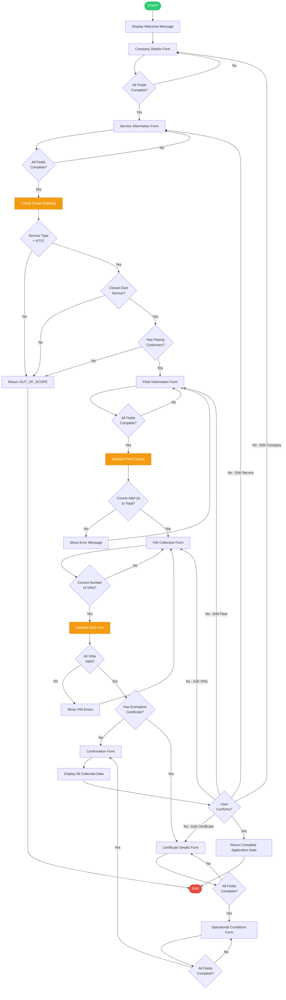
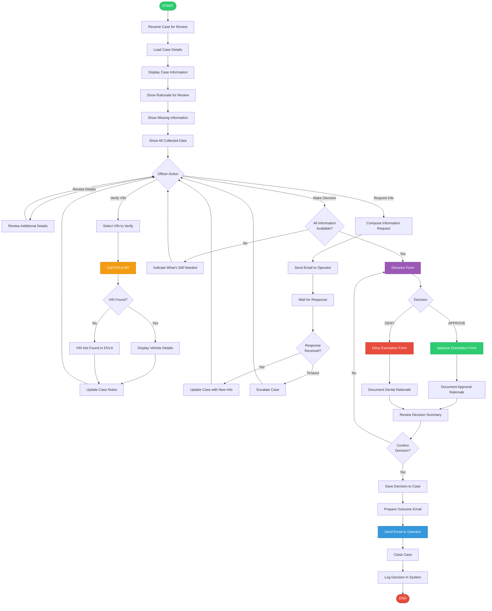
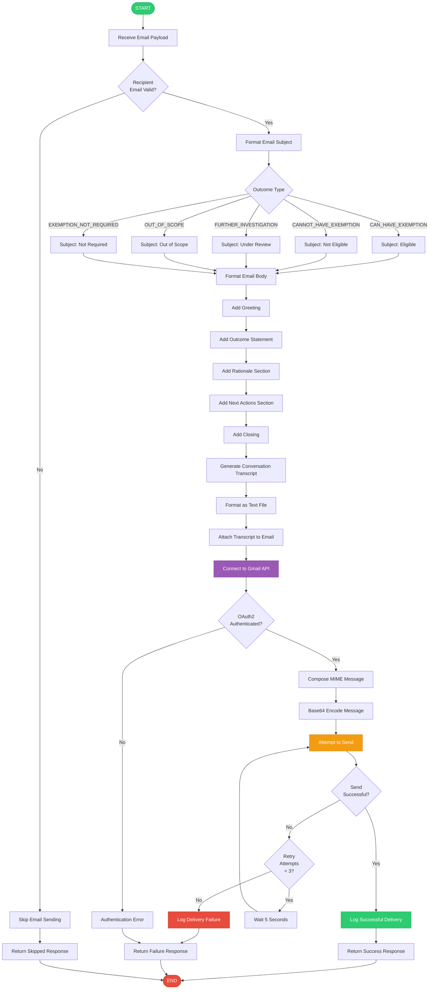
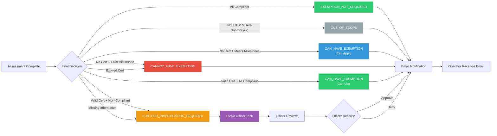
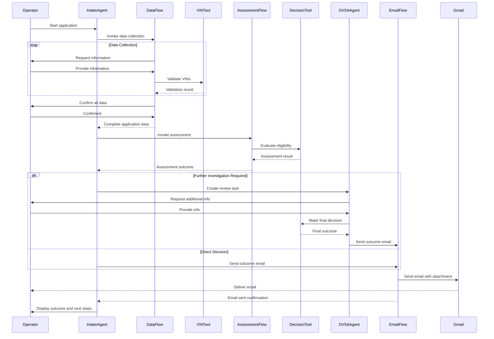
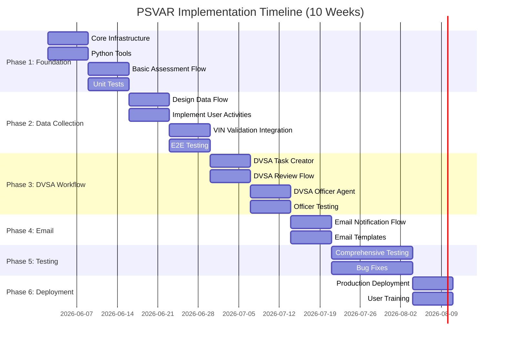

# PSVAR Exemption Workflow - Visual Diagrams

## Complete System Architecture

---

## Data Collection Flow (Detailed)

---

## Assessment Flow (Detailed)

```mermaid
flowchart TD
    Start([START]) --> Input[Receive Application Data]
    Input --> Step1[Step 1: Eligibility Screening]
    
    Step1 --> CheckHTS{Service Type<br/>= HTS?}
    CheckHTS -->|No| OutScope[Decision: OUT_OF_SCOPE]
    CheckHTS -->|Yes| CheckClosedDoor{Closed Door?}
    
    CheckClosedDoor -->|No| OutScope
    CheckClosedDoor -->|Yes| CheckPaying{Paying<br/>Customers?}
    
    CheckPaying -->|No| OutScope
    CheckPaying -->|Yes| Step2[Step 2: Fleet Assessment]
    
    Step2 --> CheckFleetSize{Fleet Size<br/>> 0?}
    CheckFleetSize -->|No| OutScope
    CheckFleetSize -->|Yes| CheckCompliance{All Vehicles<br/>Fully Compliant?}
    
    CheckCompliance -->|Yes| NotNeeded[Decision: EXEMPTION_NOT_REQUIRED]
    CheckCompliance -->|No| Step3[Step 3: Band Determination]
    
    Step3 --> DetermineBand[Calculate Band from Fleet Size]
    DetermineBand --> BandResult{Band}
    
    BandResult -->|1-5 vehicles| BandA[Band A]
    BandResult -->|6-9 vehicles| BandB[Band B]
    BandResult -->|10-29 vehicles| BandC[Band C]
    BandResult -->|30+ vehicles| BandD[Band D]
    
    BandA --> Step4
    BandB --> Step4
    BandC --> Step4
    BandD --> Step4[Step 4: Milestone Evaluation]
    
    Step4 --> GetDate[Get Assessment Date]
    GetDate --> CheckDate{Date After<br/>2026-07-31?}
    
    CheckDate -->|Yes| Expired[Decision: CANNOT_HAVE_EXEMPTION<br/>Regime Expired]
    CheckDate -->|No| CalcRequirements[Calculate Required Counts<br/>for Band and Date]
    
    CalcRequirements --> CheckFully{Meets Fully<br/>Compliant<br/>Requirement?}
    CheckFully -->|No| MilestoneFail[Milestone Non-Compliant]
    CheckFully -->|Yes| CheckPartial{Meets Partially<br/>Compliant<br/>Requirement?}
    
    CheckPartial -->|No| MilestoneFail
    CheckPartial -->|Yes| CheckRemaining{Remaining Must Be<br/>Partially Compliant?}
    
    CheckRemaining -->|Yes, but has non-compliant| MilestoneFail
    CheckRemaining -->|No or all compliant| MilestonePass[Milestone Compliant]
    
    MilestoneFail --> Step5
    MilestonePass --> Step5[Step 5: Certificate Validation]
    
    Step5 --> HasCert{Has<br/>Certificate?}
    
    HasCert -->|No| NoCertMilestone{Milestone<br/>Compliant?}
    NoCertMilestone -->|No| CannotHave[Decision: CANNOT_HAVE_EXEMPTION]
    NoCertMilestone -->|Yes| CanApply[Decision: CAN_HAVE_EXEMPTION<br/>Can Apply for Certificate]
    
    HasCert -->|Yes| CheckCertDates[Check Certificate Dates]
    CheckCertDates --> CertExpired{Certificate<br/>Expired?}
    
    CertExpired -->|Yes| CannotHave
    CertExpired -->|No| ValidCert[Valid Certificate]
    
    ValidCert --> Step6[Step 6: Operational Compliance]
    
    Step6 --> CheckOnboard{Copy Carried<br/>Onboard?}
    CheckOnboard -->|No| OpFail[Operational Non-Compliant]
    CheckOnboard -->|Yes| CheckAltTransport{Alternative<br/>Transport<br/>Available?}
    
    CheckAltTransport -->|No| OpFail
    CheckAltTransport -->|Yes| CheckWritten{Written<br/>Confirmation<br/>Retained?}
    
    CheckWritten -->|No| OpFail
    CheckWritten -->|Yes| CheckRead{Read Band<br/>Requirements?}
    
    CheckRead -->|No| OpFail
    CheckRead -->|Yes| CheckFleetChange{Fleet Size<br/>Changed?}
    
    CheckFleetChange -->|No| OpPass[Operational Compliant]
    CheckFleetChange -->|Yes| CheckNotified{DfT Notified<br/>Within 5 Days?}
    
    CheckNotified -->|No| OpFail
    CheckNotified -->|Yes| OpPass
    
    OpFail --> Step7
    OpPass --> Step7[Step 7: Final Decision]
    
    Step7 --> FinalCheck{Milestone AND<br/>Operational<br/>Compliant?}
    
    FinalCheck -->|No| CheckMissing{Missing<br/>Information?}
    CheckMissing -->|Yes| FurtherInv[Decision: FURTHER_INVESTIGATION_REQUIRED]
    CheckMissing -->|No| CannotHave
    
    FinalCheck -->|Yes| CheckMissingFinal{Missing<br/>Information?}
    CheckMissingFinal -->|Yes| FurtherInv
    CheckMissingFinal -->|No| CanHave[Decision: CAN_HAVE_EXEMPTION]
    
    OutScope --> PrepareOutput
    NotNeeded --> PrepareOutput
    CannotHave --> PrepareOutput
    CanApply --> PrepareOutput
    CanHave --> PrepareOutput
    Expired --> PrepareOutput
    FurtherInv --> CreateTask[Create DVSA Task]
    
    CreateTask --> PrepareOutput[Prepare Output Payload]
    PrepareOutput --> Output[Return Assessment Output]
    Output --> End([END])
    
    style Start fill:#2ECC71,stroke:#27AE60,color:#fff
    style End fill:#E74C3C,stroke:#C0392B,color:#fff
    style Step1 fill:#3498DB,stroke:#2980B9,color:#fff
    style Step2 fill:#3498DB,stroke:#2980B9,color:#fff
    style Step3 fill:#3498DB,stroke:#2980B9,color:#fff
    style Step4 fill:#3498DB,stroke:#2980B9,color:#fff
    style Step5 fill:#3498DB,stroke:#2980B9,color:#fff
    style Step6 fill:#3498DB,stroke:#2980B9,color:#fff
    style Step7 fill:#3498DB,stroke:#2980B9,color:#fff
    style FurtherInv fill:#F39C12,stroke:#D68910,color:#fff
    style CreateTask fill:#F39C12,stroke:#D68910,color:#fff
```

---

## DVSA Officer Review Flow (Detailed)

---

## Email Notification Flow (Detailed)

---

## Decision Outcomes Summary

---

## Component Interaction Diagram

---

## Timeline Gantt Chart

---

*All diagrams are in Mermaid format and can be rendered in any Mermaid-compatible viewer or documentation system.*