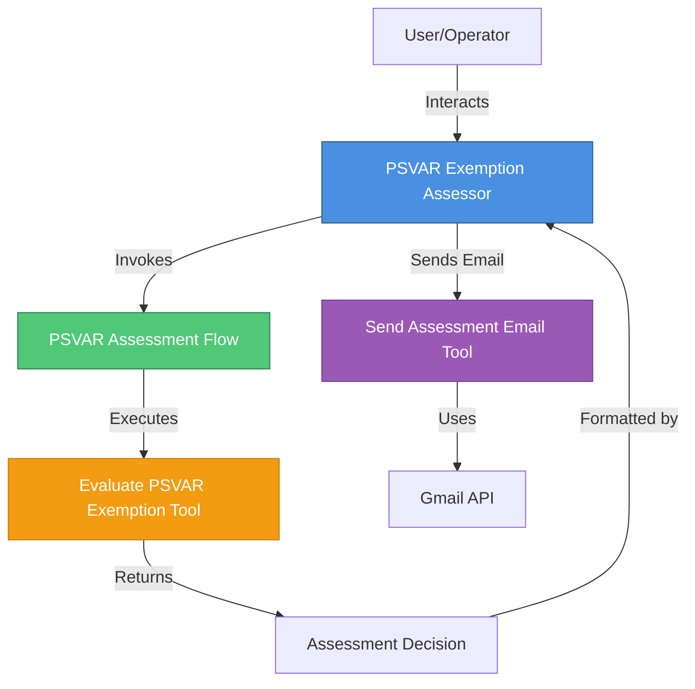
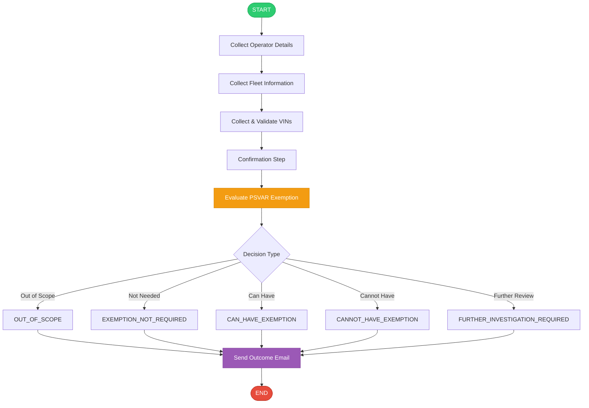

# PSVAR Exemption Assessment Agent

## Overview

The PSVAR Exemption Assessment Agent helps transport operators determine whether they can rely on PSVAR (Public Service Vehicles Accessibility Regulations) exemption guidance for home-to-school services. The agent conducts an interactive interview, validates vehicle information, evaluates compliance requirements, and provides automated email notifications with assessment outcomes.

## Architecture Diagram



## Workflow Diagram



## Features

- **Interactive Interview Process**: Form-like experience with plain English questions
- **VIN Validation**: Comprehensive validation including check digit verification
- **Band-Based Compliance**: Automatic evaluation of compliance milestones based on fleet size
- **Automated Email Notifications**: Sends outcome emails with transcript attachments
- **Gmail API Integration**: OAuth2-authenticated email delivery
- **Comprehensive Decision Logic**: Five possible outcomes with detailed rationale
- **User-Friendly Design**: No technical jargon or schema exposure to users

## Decision Outcomes

The agent can produce five possible assessment outcomes:

| Outcome | Description |
|---------|-------------|
| **CAN_HAVE_EXEMPTION** | Operator meets all requirements and can rely on the exemption |
| **CANNOT_HAVE_EXEMPTION** | Operator does not meet requirements and cannot use the exemption |
| **FURTHER_INVESTIGATION_REQUIRED** | Manual DVSA officer review needed due to missing information or edge cases |
| **OUT_OF_SCOPE** | Service not covered by this HTS-only exemption guidance |
| **EXEMPTION_NOT_REQUIRED** | Fleet is fully compliant and doesn't need an exemption |

## Components

### Agent
- **`agents/psvar_exemption_assessor.yaml`**: Main agent configuration with comprehensive instructions for conducting the assessment interview

### Tools
- **`tools/evaluate_psvar_exemption.py`**: Core assessment logic including:
  - VIN validation with check digit algorithm
  - Band-based compliance milestone evaluation
  - Operational conditions checking
  - Decision logic and rationale generation
  
- **`tools/send_assessment_outcome_email.py`**: Gmail integration for sending outcome notifications with transcript attachments

### Flow
- **`tools/psvar_exemption_assessment_flow.py`**: Orchestrates the assessment process by invoking the evaluation tool and mapping outputs

### Connections
- **`connections/gmail_connection.yaml`**: OAuth2 connection configuration for Gmail API

## Usage

### Via Chat UI

1. **Import all components**:
   ```bash
   ./import-all.sh
   ```

2. **Launch chat interface**:
   ```bash
   orchestrate chat start
   ```

3. **Select the agent**:
   - Choose `psvar_exemption_assessment` from the agent list

4. **Follow the interactive assessment**:
   - Answer questions about your company and fleet
   - Provide VINs for validation
   - Confirm the information
   - Receive the assessment outcome

### Programmatically

1. **Set PYTHONPATH**:
   ```bash
   export PYTHONPATH=/path/to/adk/src:/path/to/adk
   ```

2. **Run the test script**:
   ```bash
   python3 main_flow.py
   ```

## Prerequisites

- **watsonx Orchestrate environment** (local Developer Edition or production instance)
- **Gmail connection** configured with OAuth2 credentials:
  - Client ID and Client Secret from Google Cloud Console
  - Gmail API enabled
  - OAuth2 scopes: `https://www.googleapis.com/auth/gmail.send`

## Information Collected

The agent collects the following information during the assessment:

### Company Details
- Company name
- Operator licence number
- Authorised contact name, telephone, email
- Postal address and postcode

### Service Information
- Service types (HTS only in this version)
- Whether services are closed-door
- Whether services have paying customers

### Fleet Information
- Total fleet size
- Number of fully compliant vehicles
- Number of partially compliant vehicles
- Number of non-compliant vehicles
- VINs for all vehicles
- VINs for partially compliant vehicles (if applicable)
- VINs for non-compliant vehicles (if applicable)

### Exemption Certificate Details (if applicable)
- Whether an exemption certificate exists
- Certificate reference number
- Start and end dates
- Whether copy is carried onboard
- Whether alternative accessible transport is available
- Whether written confirmation is retained

### Compliance Confirmation
- Confirmation of reading band compliance requirements
- Whether fleet size has changed
- Whether DfT was notified within 5 days (if applicable)

## Compliance Bands

The system evaluates operators based on fleet size bands:

| Band | Fleet Size | Milestone Requirements |
|------|-----------|------------------------|
| **A** | 1-5 vehicles | Progressive compliance milestones |
| **B** | 6-9 vehicles | Progressive compliance milestones |
| **C** | 10-29 vehicles | Progressive compliance milestones |
| **D** | 30+ vehicles | Progressive compliance milestones |

Each band has specific requirements for minimum numbers of fully compliant and partially compliant vehicles that increase over time.

## VIN Validation

The agent performs comprehensive VIN validation:

- ✅ Must be exactly 17 characters
- ✅ Must contain only uppercase letters and digits
- ✅ Must not contain I, O, or Q
- ✅ Must pass check digit validation (position 9)
- ✅ Must be unique within the fleet

## Email Notifications

When an assessment is complete, the agent:

1. Generates an outcome email with:
   - Assessment decision
   - Detailed rationale
   - Next actions
   
2. Attaches a transcript of the assessment conversation

3. Sends via Gmail API to the authorised contact email

4. Confirms delivery to the operator

## Project Structure

```
PSVARExemption/
├── README.md                          # This file
├── BEST_PRACTICES_REVIEW.md          # Best practices review document
├── import-all.sh                      # Import script for CLI
├── main_flow.py                       # Programmatic testing script
├── agents/
│   └── psvar_exemption_assessor.yaml # Agent configuration
├── tools/
│   ├── evaluate_psvar_exemption.py   # Core assessment logic
│   ├── send_assessment_outcome_email.py # Email tool
│   └── psvar_exemption_assessment_flow.py # Flow definition
├── connections/
│   └── gmail_connection.yaml         # Gmail OAuth2 connection
├── generated/
│   └── psvar_exemption_assessment_flow.json # Compiled flow spec
└── tests/
    ├── test_vin_validation.py        # VIN validation tests
    └── test_band_evaluation.py       # Band logic tests
```

## Development

### Running Tests

```bash
# Run all tests
pytest tests/

# Run specific test file
pytest tests/test_vin_validation.py

# Run with coverage
pytest --cov=tools tests/
```

### Generating Flow Specification

The flow specification is automatically generated when running `main_flow.py` and saved to `generated/psvar_exemption_assessment_flow.json`.

## Troubleshooting

### Gmail Authentication Issues

If email sending fails:

1. Verify Gmail connection is properly configured
2. Check OAuth2 credentials are valid
3. Ensure Gmail API is enabled in Google Cloud Console
4. Verify scopes include `gmail.send`

### VIN Validation Failures

If VINs are rejected:

1. Ensure VINs are exactly 17 characters
2. Remove any spaces or special characters
3. Use uppercase letters only
4. Avoid I, O, and Q characters
5. Verify the check digit (position 9) is correct

### Import Errors

If import fails:

1. Ensure you're in the correct directory
2. Check file permissions on `import-all.sh`
3. Verify watsonx Orchestrate CLI is installed
4. Check connection configurations exist

## References

- [watsonx Orchestrate Documentation](https://developer.watson-orchestrate.ibm.com)
- [ADK GitHub Repository](https://github.com/IBM/watsonx-orchestrate-adk)
- [PSVAR Regulations](https://www.gov.uk/government/publications/public-service-vehicles-accessibility-regulations)

## License

This project is developed for DVSA (Driver and Vehicle Standards Agency) use.

---

*Built with watsonx Orchestrate Agent Development Kit*