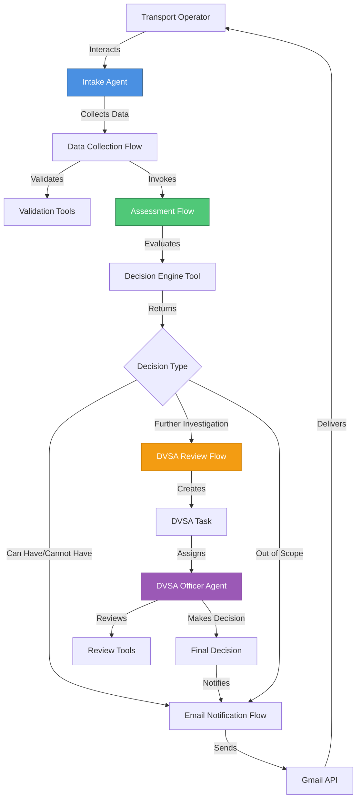
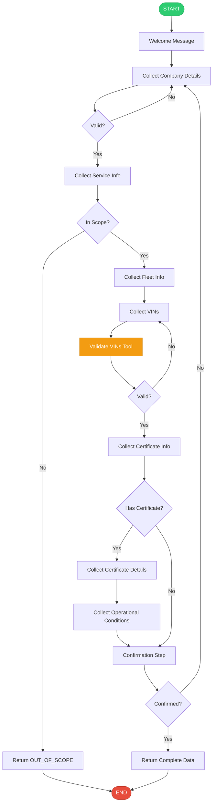
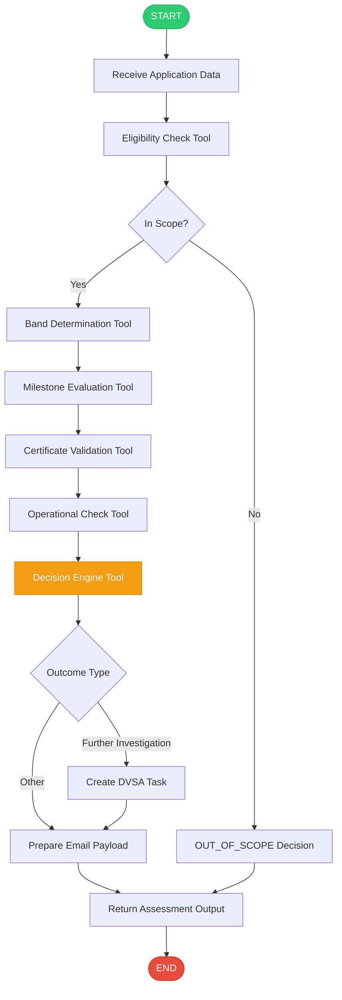
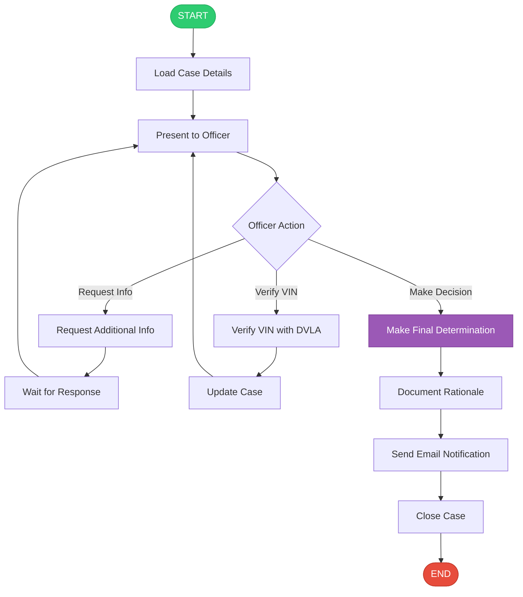
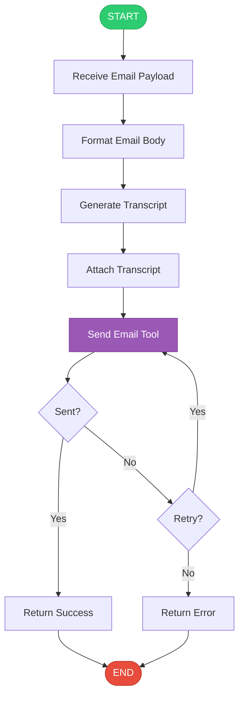

# watsonx Orchestrate Implementation Plan - PSVAR Exemption Workflow

## Executive Summary

This document outlines the complete implementation plan for building the PSVAR exemption assessment workflow in watsonx Orchestrate, based on the requirements defined in [`PSVAR_WORKFLOW_AND_DATA_REQUIREMENTS.md`](PSVAR_WORKFLOW_AND_DATA_REQUIREMENTS.md).

**Project Goal**: Implement an automated PSVAR exemption assessment system that:
- Conducts interactive interviews with transport operators
- Validates fleet data and VINs
- Evaluates compliance against progressive milestones
- Routes complex cases to DVSA officers for manual review
- Sends automated email notifications with outcomes

**Implementation Approach**: Multi-agent system with specialized flows and tools

---

## Table of Contents

1. [Architecture Overview](#architecture-overview)
2. [Component Design](#component-design)
3. [Implementation Phases](#implementation-phases)
4. [Detailed Component Specifications](#detailed-component-specifications)
5. [Integration Points](#integration-points)
6. [Testing Strategy](#testing-strategy)
7. [Deployment Plan](#deployment-plan)
8. [Success Criteria](#success-criteria)

---

## Architecture Overview

### High-Level Architecture



### System Components

| Component Type | Component Name | Purpose |
|---------------|----------------|---------|
| **Agent** | Intake Agent | Conducts initial interview with operator |
| **Agent** | DVSA Officer Agent | Handles manual review cases |
| **Flow** | Data Collection Flow | Structured data gathering with validation |
| **Flow** | Assessment Flow | Evaluates eligibility and compliance |
| **Flow** | DVSA Review Flow | Manages officer review workflow |
| **Flow** | Email Notification Flow | Sends outcome emails |
| **Tool** | VIN Validation Tool | Validates Vehicle Identification Numbers |
| **Tool** | Band Determination Tool | Assigns compliance band |
| **Tool** | Milestone Evaluation Tool | Checks milestone compliance |
| **Tool** | Decision Engine Tool | Makes final assessment decision |
| **Tool** | Email Sender Tool | Sends emails via Gmail API |
| **Tool** | DVSA Task Creator Tool | Creates tasks for officers |
| **Connection** | Gmail Connection | OAuth2 connection to Gmail API |
| **Knowledge Base** | PSVAR Guidance KB | Contains regulation text and guidance |

---

## Component Design

### 1. Agents

#### 1.1 Intake Agent (`psvar_intake_agent`)

**Purpose**: Primary interface for transport operators applying for exemptions

**Responsibilities**:
- Greet operator and explain the assessment process
- Invoke data collection flow to gather information
- Invoke assessment flow to evaluate eligibility
- Present results in user-friendly language
- Handle follow-up questions

**Tools Available**:
- `psvar_data_collection_flow`
- `psvar_assessment_flow`
- `send_email_notification`

**Instructions**:
```yaml
instructions: |
  You are a helpful assistant helping transport operators apply for PSVAR exemptions.
  
  Your role is to:
  1. Greet the operator warmly and explain the assessment process
  2. Invoke the psvar_data_collection_flow to gather all required information
  3. Once data is collected, invoke the psvar_assessment_flow to evaluate eligibility
  4. Present the assessment outcome in clear, non-technical language
  5. Explain next steps based on the outcome
  6. Answer any follow-up questions the operator may have
  
  Always be professional, clear, and supportive. This is a regulatory process
  but you should make it as smooth as possible for the operator.
```

#### 1.2 DVSA Officer Agent (`dvsa_officer_agent`)

**Purpose**: Handles cases requiring manual review

**Responsibilities**:
- Review cases flagged for further investigation
- Request additional information from operators
- Verify VINs against DVLA records
- Make final determination on exemption eligibility
- Document decision rationale
- Trigger email notifications

**Tools Available**:
- `review_case_details`
- `verify_vin_with_dvla`
- `request_additional_info`
- `make_final_determination`
- `send_email_notification`

**Instructions**:
```yaml
instructions: |
  You are a DVSA officer reviewing PSVAR exemption applications that require
  manual investigation.
  
  Your role is to:
  1. Review all collected information and rationale for further investigation
  2. Identify what additional information or verification is needed
  3. Use available tools to verify VINs, check operator records, etc.
  4. Request additional information from operators if needed
  5. Make a final determination: APPROVE or DENY
  6. Document your decision rationale clearly
  7. Trigger email notification to the operator
  
  Be thorough, fair, and consistent in your reviews. Document all decisions
  with clear rationale.
```

### 2. Flows

#### 2.1 Data Collection Flow (`psvar_data_collection_flow`)

**Purpose**: Structured data gathering with validation

**Input Schema**: None (interactive)

**Output Schema**: `PSVARApplicationData`

**Flow Steps**:



**Key Features**:
- User activity nodes for interactive data collection
- Real-time VIN validation
- Conditional branching based on responses
- Confirmation step before proceeding
- Early exit for out-of-scope services

#### 2.2 Assessment Flow (`psvar_assessment_flow`)

**Purpose**: Evaluates eligibility and compliance

**Input Schema**: `PSVARApplicationData`

**Output Schema**: `PSVARAssessmentOutput`

**Flow Steps**:



**Key Features**:
- Sequential evaluation steps
- Each step produces rationale
- Accumulates missing information
- Creates DVSA task if needed
- Prepares email notification payload

#### 2.3 DVSA Review Flow (`dvsa_review_flow`)

**Purpose**: Manages officer review workflow

**Input Schema**: `DVSAReviewInput` (case details)

**Output Schema**: `DVSAReviewOutput` (final decision)

**Flow Steps**:



**Key Features**:
- Presents case details to officer
- Supports multiple officer actions
- Tracks case status
- Documents all decisions
- Triggers final notification

#### 2.4 Email Notification Flow (`email_notification_flow`)

**Purpose**: Sends outcome emails with attachments

**Input Schema**: `EmailNotificationInput`

**Output Schema**: `EmailNotificationOutput`

**Flow Steps**:



### 3. Python Tools

#### 3.1 VIN Validation Tool (`validate_vin`)

**Purpose**: Validates Vehicle Identification Numbers

**Implementation**: Already exists in [`tools/evaluate_psvar_exemption.py`](tools/evaluate_psvar_exemption.py:254-292)

**Validation Rules**:
- Exactly 17 characters
- Only uppercase letters and digits
- No I, O, or Q characters
- Valid check digit (position 9)
- No duplicates in collection

#### 3.2 Band Determination Tool (`determine_band`)

**Purpose**: Assigns compliance band based on fleet size

**Implementation**: Already exists in [`tools/evaluate_psvar_exemption.py`](tools/evaluate_psvar_exemption.py:323-332)

**Logic**:
- 1-5 vehicles → Band A
- 6-9 vehicles → Band B
- 10-29 vehicles → Band C
- 30+ vehicles → Band D

#### 3.3 Milestone Evaluation Tool (`evaluate_milestone`)

**Purpose**: Checks if fleet meets current milestone requirements

**Implementation**: Already exists in [`tools/evaluate_psvar_exemption.py`](tools/evaluate_psvar_exemption.py:335-416)

**Features**:
- Date-based milestone requirements
- Band-specific thresholds
- Percentage calculations with ceiling
- Detailed rationale generation

#### 3.4 Decision Engine Tool (`evaluate_psvar_exemption`)

**Purpose**: Makes final assessment decision

**Implementation**: Already exists in [`tools/evaluate_psvar_exemption.py`](tools/evaluate_psvar_exemption.py:487-935)

**Outputs**:
- Decision type
- Final case outcome
- Compliance band
- Milestone compliance status
- Operational compliance status
- DVSA task payload
- Email notification payload
- Rationale list
- Next actions list
- Missing information list

#### 3.5 Email Sender Tool (`send_assessment_outcome_email`)

**Purpose**: Sends emails via Gmail API

**Implementation**: Already exists in [`tools/send_assessment_outcome_email.py`](tools/send_assessment_outcome_email.py)

**Features**:
- OAuth2 authentication
- Attachment support
- HTML email formatting
- Error handling and retries

#### 3.6 DVSA Task Creator Tool (`create_dvsa_task`)

**Purpose**: Creates tasks for DVSA officers

**Implementation**: **NEW - Needs to be created**

**Functionality**:
```python
@tool(permission=ToolPermission.WRITE)
def create_dvsa_task(task_payload: DVSATaskPayload) -> dict:
    """
    Creates a task for DVSA officer review.
    
    This would integrate with a task management system (e.g., ServiceNow,
    Jira, or custom system) to create a review task.
    """
    # Implementation would depend on task management system
    pass
```

#### 3.7 DVLA VIN Verification Tool (`verify_vin_with_dvla`)

**Purpose**: Verifies VINs against DVLA records

**Implementation**: **NEW - Needs to be created**

**Functionality**:
```python
@tool(
    permission=ToolPermission.READ_ONLY,
    expected_credentials=[
        ExpectedCredentials(app_id="dvla_api", type=ConnectionType.API_KEY_AUTH)
    ]
)
def verify_vin_with_dvla(vin: str, credentials: dict) -> dict:
    """
    Verifies a VIN against DVLA vehicle records.
    
    Returns vehicle details if found, or error if not found.
    """
    # Implementation would call DVLA API
    pass
```

---

## Implementation Phases

### Phase 1: Foundation (Week 1-2)

**Goal**: Set up core infrastructure and basic assessment flow

**Tasks**:
1. ✅ Review existing implementation (already done)
2. Create project structure following ADK best practices
3. Set up connections (Gmail, DVLA API if available)
4. Implement/refine core Python tools:
   - VIN validation (already exists)
   - Band determination (already exists)
   - Milestone evaluation (already exists)
   - Decision engine (already exists)
5. Create basic assessment flow
6. Create intake agent
7. Write unit tests for all tools

**Deliverables**:
- Working assessment flow
- Intake agent that can conduct basic assessments
- Unit tests with >80% coverage
- Documentation

### Phase 2: Data Collection (Week 3-4)

**Goal**: Implement interactive data collection flow

**Tasks**:
1. Design data collection flow with user activity nodes
2. Implement form-like data gathering
3. Add real-time VIN validation
4. Add confirmation step
5. Integrate with assessment flow
6. Test end-to-end operator journey

**Deliverables**:
- Complete data collection flow
- Integrated intake agent
- User acceptance testing results
- Updated documentation

### Phase 3: DVSA Officer Workflow (Week 5-6)

**Goal**: Implement manual review workflow

**Tasks**:
1. Create DVSA task creator tool
2. Implement DVSA review flow
3. Create DVSA officer agent
4. Add DVLA VIN verification tool (if API available)
5. Implement case management features
6. Test officer workflow

**Deliverables**:
- DVSA review flow
- DVSA officer agent
- Task management integration
- Officer training documentation

### Phase 4: Email Notifications (Week 7)

**Goal**: Implement automated email notifications

**Tasks**:
1. Refine email sender tool (already exists)
2. Create email notification flow
3. Add transcript generation
4. Test email delivery
5. Add email templates for each outcome type

**Deliverables**:
- Email notification flow
- Email templates
- Delivery confirmation
- Email testing results

### Phase 5: Testing & Refinement (Week 8-9)

**Goal**: Comprehensive testing and refinement

**Tasks**:
1. End-to-end testing with real scenarios
2. User acceptance testing with operators
3. Officer acceptance testing with DVSA staff
4. Performance testing
5. Security review
6. Bug fixes and refinements

**Deliverables**:
- Test results and reports
- Bug fix documentation
- Performance metrics
- Security audit report

### Phase 6: Deployment (Week 10)

**Goal**: Deploy to production

**Tasks**:
1. Prepare production environment
2. Deploy agents and flows
3. Configure connections
4. Set up monitoring and logging
5. Train users (operators and officers)
6. Go live with pilot group
7. Monitor and support

**Deliverables**:
- Production deployment
- User training materials
- Monitoring dashboard
- Support documentation

---

## Detailed Component Specifications

### Data Collection Flow Specification

**File**: `tools/psvar_data_collection_flow.py`

```python
from pydantic import BaseModel, Field
from ibm_watsonx_orchestrate.flow_builder.flows import Flow, flow, START, END

class CompanyDetails(BaseModel):
    company_name: str
    operator_licence_number: str
    contact_name: str
    contact_telephone: str
    contact_email: str
    postal_address: str
    postcode: str

class ServiceInfo(BaseModel):
    service_types: list[str]
    hts_closed_door: bool
    hts_has_paying_customers: bool

class FleetInfo(BaseModel):
    total_fleet_size: int
    fully_compliant_count: int
    partially_compliant_count: int
    non_compliant_count: int
    vins: list[str]
    partially_compliant_vins: list[str]
    non_compliant_vins: list[str]

class CertificateInfo(BaseModel):
    has_certificate: bool
    certificate_reference: str | None
    start_date: str | None
    end_date: str | None
    copy_onboard: bool | None
    alternative_transport: bool | None
    written_confirmation: bool | None
    read_requirements: bool | None
    fleet_size_changed: bool | None
    dft_notified: bool | None

class PSVARApplicationData(BaseModel):
    company: CompanyDetails
    service: ServiceInfo
    fleet: FleetInfo
    certificate: CertificateInfo
    assessment_date: str

@flow(
    name="psvar_data_collection_flow",
    display_name="PSVAR Data Collection Flow",
    description="Interactive data collection for PSVAR exemption assessment",
    output_schema=PSVARApplicationData
)
def build_psvar_data_collection_flow(aflow: Flow) -> Flow:
    """
    Build the data collection flow with user activity nodes.
    """
    
    # Welcome message
    welcome = aflow.prompt(
        name="welcome",
        system_prompt="You are a helpful assistant.",
        user_prompt=["Welcome to the PSVAR exemption assessment. I'll guide you through the process."]
    )
    
    # Collect company details
    company_activity = aflow.user_activity(
        name="collect_company",
        display_name="Company Details",
        description="Please provide your company details"
    )
    
    # Collect service information
    service_activity = aflow.user_activity(
        name="collect_service",
        display_name="Service Information",
        description="Tell us about your services"
    )
    
    # Check if in scope
    scope_check = aflow.script(
        name="check_scope",
        code="""
in_scope = (
    'HTS' in service_types and
    hts_closed_door and
    hts_has_paying_customers
)
result = {'in_scope': in_scope}
        """,
        input_schema=ServiceInfo,
        output_schema=type('ScopeResult', (BaseModel,), {
            'in_scope': (bool, Field(description="Whether service is in scope"))
        })
    )
    
    # Collect fleet information
    fleet_activity = aflow.user_activity(
        name="collect_fleet",
        display_name="Fleet Information",
        description="Provide details about your fleet"
    )
    
    # Validate VINs
    from .evaluate_psvar_exemption import validate_vin
    vin_validation = aflow.tool(validate_vin)
    
    # Collect certificate information
    cert_activity = aflow.user_activity(
        name="collect_certificate",
        display_name="Certificate Information",
        description="Do you have an existing exemption certificate?"
    )
    
    # Confirmation step
    confirm_activity = aflow.user_activity(
        name="confirm_data",
        display_name="Confirm Information",
        description="Please review and confirm all information"
    )
    
    # Build sequence
    aflow.sequence(
        START,
        welcome,
        company_activity,
        service_activity,
        scope_check
    )
    
    # Conditional branching
    aflow.if_else(
        condition="flow['check_scope'].output.in_scope",
        if_true=fleet_activity,
        if_false=END
    )
    
    aflow.sequence(
        fleet_activity,
        vin_validation,
        cert_activity,
        confirm_activity,
        END
    )
    
    # Map outputs
    aflow.map_output(
        output_variable="company",
        expression="flow['collect_company'].output"
    )
    aflow.map_output(
        output_variable="service",
        expression="flow['collect_service'].output"
    )
    aflow.map_output(
        output_variable="fleet",
        expression="flow['collect_fleet'].output"
    )
    aflow.map_output(
        output_variable="certificate",
        expression="flow['collect_certificate'].output"
    )
    
    return aflow
```

### DVSA Review Flow Specification

**File**: `tools/dvsa_review_flow.py`

```python
from pydantic import BaseModel, Field
from ibm_watsonx_orchestrate.flow_builder.flows import Flow, flow, START, END

class DVSAReviewInput(BaseModel):
    case_id: str
    operator_name: str
    assessment_data: dict
    rationale: list[str]
    missing_information: list[str]

class DVSAReviewOutput(BaseModel):
    case_id: str
    decision: str  # APPROVE or DENY
    rationale: str
    officer_name: str
    review_date: str

@flow(
    name="dvsa_review_flow",
    display_name="DVSA Officer Review Flow",
    description="Workflow for DVSA officer manual review",
    input_schema=DVSAReviewInput,
    output_schema=DVSAReviewOutput
)
def build_dvsa_review_flow(aflow: Flow) -> Flow:
    """
    Build the DVSA officer review workflow.
    """
    
    # Present case to officer
    present_case = aflow.prompt(
        name="present_case",
        system_prompt="You are presenting a case for DVSA officer review.",
        user_prompt=[
            "Case ID: {case_id}",
            "Operator: {operator_name}",
            "Rationale for review: {rationale}",
            "Missing information: {missing_information}"
        ]
    )
    
    # Officer makes decision
    officer_decision = aflow.user_activity(
        name="officer_decision",
        display_name="Make Decision",
        description="Review the case and make a determination"
    )
    
    # Document rationale
    document = aflow.user_activity(
        name="document_rationale",
        display_name="Document Decision",
        description="Document your decision rationale"
    )
    
    # Send notification
    from .send_assessment_outcome_email import send_assessment_outcome_email
    send_email = aflow.tool(send_assessment_outcome_email)
    
    # Build sequence
    aflow.sequence(
        START,
        present_case,
        officer_decision,
        document,
        send_email,
        END
    )
    
    # Map outputs
    aflow.map_output(
        output_variable="case_id",
        expression="flow.input.case_id"
    )
    aflow.map_output(
        output_variable="decision",
        expression="flow['officer_decision'].output.decision"
    )
    aflow.map_output(
        output_variable="rationale",
        expression="flow['document_rationale'].output.rationale"
    )
    
    return aflow
```

---

## Integration Points

### 1. Gmail API Integration

**Status**: ✅ Already implemented

**Connection**: [`connections/gmail_connection.yaml`](connections/gmail_connection.yaml)

**Tool**: [`tools/send_assessment_outcome_email.py`](tools/send_assessment_outcome_email.py)

**Configuration**:
- OAuth2 authentication
- Scopes: `gmail.send`
- Client ID and Secret from Google Cloud Console

### 2. DVLA API Integration

**Status**: ❌ Not yet implemented

**Purpose**: Verify VINs against DVLA vehicle records

**Requirements**:
- API key or OAuth2 credentials
- API endpoint URL
- Rate limiting handling
- Error handling for not found vehicles

**Connection Configuration**:
```yaml
# connections/dvla_api_connection.yaml
spec_version: v1
kind: api_key
name: dvla_api
description: Connection to DVLA vehicle records API
config:
  api_key_location: header
  api_key_name: X-API-Key
```

### 3. Task Management System Integration

**Status**: ❌ Not yet implemented

**Purpose**: Create and manage DVSA officer review tasks

**Options**:
1. **ServiceNow**: Enterprise task management
2. **Jira**: Agile project management
3. **Custom System**: Internal DVSA system
4. **Simple Database**: PostgreSQL/MongoDB for task tracking

**Recommended**: Start with simple database, migrate to enterprise system later

### 4. Knowledge Base Integration

**Status**: ❌ Not yet implemented

**Purpose**: Provide PSVAR guidance and regulations to agents

**Content**:
- PSVAR 2000 regulations text
- GOV.UK guidance documents
- Compliance schedules
- FAQ content

**Implementation**:
```bash
# Create knowledge base
orchestrate knowledge-bases create \
  --name psvar_guidance \
  --description "PSVAR regulations and guidance" \
  --source-type document \
  --documents ./knowledge-bases/psvar/
```

---

## Testing Strategy

### 1. Unit Testing

**Scope**: Individual Python tools

**Framework**: pytest

**Coverage Target**: >80%

**Test Files**:
- ✅ `tests/test_vin_validation.py` (already exists)
- ✅ `tests/test_band_evaluation.py` (already exists)
- ❌ `tests/test_decision_engine.py` (needs creation)
- ❌ `tests/test_email_sender.py` (needs creation)

**Example Test**:
```python
def test_band_determination():
    assert determine_band(3) == "A"
    assert determine_band(7) == "B"
    assert determine_band(15) == "C"
    assert determine_band(50) == "D"
```

### 2. Integration Testing

**Scope**: Flow execution and tool integration

**Approach**: Programmatic flow testing

**Test File**: `main_flow.py` (already exists)

**Test Scenarios**:
1. ✅ Fully compliant fleet (already tested)
2. ✅ Fleet needs exemption (already tested)
3. ✅ Valid certificate (already tested)
4. ✅ Out of scope (already tested)
5. ❌ Further investigation required (needs testing)
6. ❌ Certificate expired (needs testing)
7. ❌ Milestone non-compliant (needs testing)

### 3. End-to-End Testing

**Scope**: Complete user journeys

**Approach**: Manual testing via chat UI

**Test Cases**:

| Test Case | Description | Expected Outcome |
|-----------|-------------|------------------|
| TC-001 | New operator, fully compliant fleet | EXEMPTION_NOT_REQUIRED |
| TC-002 | New operator, needs exemption, meets milestones | CAN_HAVE_EXEMPTION |
| TC-003 | New operator, doesn't meet milestones | CANNOT_HAVE_EXEMPTION |
| TC-004 | Existing certificate, all conditions met | CAN_HAVE_EXEMPTION |
| TC-005 | Existing certificate, milestone non-compliant | FURTHER_INVESTIGATION_REQUIRED |
| TC-006 | Existing certificate, operational non-compliant | FURTHER_INVESTIGATION_REQUIRED |
| TC-007 | Certificate expired | CANNOT_HAVE_EXEMPTION |
| TC-008 | Not closed-door service | OUT_OF_SCOPE |
| TC-009 | No paying customers | OUT_OF_SCOPE |
| TC-010 | Invalid VINs provided | FURTHER_INVESTIGATION_REQUIRED |

### 4. User Acceptance Testing

**Scope**: Real operators and DVSA officers

**Participants**:
- 5-10 transport operators
- 3-5 DVSA officers

**Duration**: 2 weeks

**Metrics**:
- Task completion rate
- Time to complete assessment
- User satisfaction score
- Error rate
- Support requests

### 5. Performance Testing

**Scope**: System performance under load

**Metrics**:
- Flow execution time
- Concurrent user capacity
- Email delivery time
- Database query performance

**Targets**:
- Assessment completion: <5 minutes
- Email delivery: <30 seconds
- Support 50 concurrent users
- 99.9% uptime

---

## Deployment Plan

### Pre-Deployment Checklist

- [ ] All unit tests passing
- [ ] Integration tests passing
- [ ] End-to-end tests passing
- [ ] User acceptance testing complete
- [ ] Security review complete
- [ ] Documentation complete
- [ ] Training materials prepared
- [ ] Support team trained
- [ ] Monitoring configured
- [ ] Backup procedures tested

### Deployment Steps

#### 1. Environment Setup

```bash
# Activate production environment
orchestrate env activate production

# Verify environment
orchestrate env info
```

#### 2. Deploy Connections

```bash
# Import Gmail connection
orchestrate connections import -f connections/gmail_connection.yaml

# Import DVLA API connection (if available)
orchestrate connections import -f connections/dvla_api_connection.yaml

# Configure credentials
orchestrate connections configure \
  --app-id gmail_connection \
  --environment live \
  --type team
```

#### 3. Deploy Tools

```bash
# Import Python tools
orchestrate tools import -k python -f tools/evaluate_psvar_exemption.py
orchestrate tools import -k python -f tools/send_assessment_outcome_email.py
orchestrate tools import -k python -f tools/create_dvsa_task.py
orchestrate tools import -k python -f tools/verify_vin_with_dvla.py

# Import Flow tools
orchestrate tools import -k flow -f tools/psvar_data_collection_flow.py
orchestrate tools import -k flow -f tools/psvar_assessment_flow.py
orchestrate tools import -k flow -f tools/dvsa_review_flow.py
orchestrate tools import -k flow -f tools/email_notification_flow.py
```

#### 4. Deploy Agents

```bash
# Import agents
orchestrate agents import -f agents/psvar_intake_agent.yaml
orchestrate agents import -f agents/dvsa_officer_agent.yaml
```

#### 5. Deploy Knowledge Base

```bash
# Create and populate knowledge base
orchestrate knowledge-bases import -f knowledge-bases/psvar_guidance.yaml
```

#### 6. Verify Deployment

```bash
# List all components
orchestrate agents list
orchestrate tools list
orchestrate connections list
orchestrate knowledge-bases list

# Test basic functionality
orchestrate chat start --agent psvar_intake_agent
```

### Post-Deployment

#### 1. Monitoring Setup

- Configure logging and metrics collection
- Set up alerts for errors and performance issues
- Create monitoring dashboard

#### 2. User Training

- Conduct training sessions for operators
- Conduct training sessions for DVSA officers
- Provide user guides and documentation

#### 3. Support

- Establish support channels (email, phone, chat)
- Create FAQ and troubleshooting guides
- Monitor support requests and feedback

#### 4. Continuous Improvement

- Collect user feedback
- Monitor system metrics
- Identify improvement opportunities
- Plan and implement enhancements

---

## Success Criteria

### Functional Requirements

- ✅ System correctly assesses eligibility for all 5 outcome types
- ✅ VIN validation catches all invalid VINs
- ✅ Band determination is accurate for all fleet sizes
- ✅ Milestone evaluation is correct for all dates and bands
- ✅ Email notifications are sent successfully
- ✅ DVSA officer workflow functions correctly
- ✅ All edge cases are handled appropriately

### Non-Functional Requirements

- ✅ Assessment completion time <5 minutes
- ✅ System supports 50 concurrent users
- ✅ 99.9% uptime
- ✅ Email delivery <30 seconds
- ✅ User satisfaction score >4.0/5.0
- ✅ Support request rate <5% of assessments

### Business Requirements

- ✅ Reduces manual assessment time by 70%
- ✅ Improves consistency of decisions
- ✅ Provides audit trail for all assessments
- ✅ Reduces operator confusion and support requests
- ✅ Enables data-driven policy improvements

---

## Risk Management

### Technical Risks

| Risk | Impact | Probability | Mitigation |
|------|--------|-------------|------------|
| Gmail API rate limits | High | Medium | Implement queuing and retry logic |
| DVLA API unavailable | Medium | Low | Implement fallback to manual verification |
| VIN validation errors | High | Low | Comprehensive testing and validation |
| Flow execution failures | High | Low | Error handling and monitoring |

### Operational Risks

| Risk | Impact | Probability | Mitigation |
|------|--------|-------------|------------|
| User adoption resistance | Medium | Medium | Training and change management |
| Officer workflow disruption | High | Low | Pilot testing and gradual rollout |
| Data quality issues | Medium | Medium | Validation and data cleansing |
| Support overload | Medium | Low | Comprehensive documentation and FAQ |

### Compliance Risks

| Risk | Impact | Probability | Mitigation |
|------|--------|-------------|------------|
| Incorrect decisions | High | Low | Thorough testing and validation |
| Data privacy violations | High | Low | Security review and compliance audit |
| Audit trail gaps | Medium | Low | Comprehensive logging |
| Regulatory changes | Medium | Medium | Flexible architecture for updates |

---

## Next Steps

### Immediate Actions (This Week)

1. Review this implementation plan with stakeholders
2. Confirm technical approach and architecture
3. Identify any missing requirements or concerns
4. Assign team members to implementation phases
5. Set up development environment
6. Begin Phase 1 implementation

### Short-Term Actions (Next 2 Weeks)

1. Complete Phase 1: Foundation
2. Begin Phase 2: Data Collection
3. Set up testing infrastructure
4. Create project tracking and reporting

### Medium-Term Actions (Next 2 Months)

1. Complete all implementation phases
2. Conduct comprehensive testing
3. Prepare for deployment
4. Train users

### Long-Term Actions (3+ Months)

1. Deploy to production
2. Monitor and support
3. Collect feedback and metrics
4. Plan enhancements and improvements

---

## Appendices

### A. File Structure

```
PSVARExemption/
├── README.md
├── WATSONX_ORCHESTRATE_IMPLEMENTATION_PLAN.md (this file)
├── PSVAR_WORKFLOW_AND_DATA_REQUIREMENTS.md
├── import-all.sh
├── main_flow.py
├── requirements.txt
├── pytest.ini
├── .gitignore
├── agents/
│   ├── psvar_intake_agent.yaml
│   └── dvsa_officer_agent.yaml
├── tools/
│   ├── evaluate_psvar_exemption.py (✅ exists)
│   ├── send_assessment_outcome_email.py (✅ exists)
│   ├── psvar_assessment_flow.py (✅ exists)
│   ├── psvar_data_collection_flow.py (❌ needs creation)
│   ├── dvsa_review_flow.py (❌ needs creation)
│   ├── email_notification_flow.py (❌ needs creation)
│   ├── create_dvsa_task.py (❌ needs creation)
│   └── verify_vin_with_dvla.py (❌ needs creation)
├── connections/
│   ├── gmail_connection.yaml (✅ exists)
│   └── dvla_api_connection.yaml (❌ needs creation)
├── knowledge-bases/
│   └── psvar_guidance/ (❌ needs creation)
├── tests/
│   ├── test_vin_validation.py (✅ exists)
│   ├── test_band_evaluation.py (✅ exists)
│   ├── test_decision_engine.py (❌ needs creation)
│   └── test_email_sender.py (❌ needs creation)
└── generated/
    └── *.json (flow specifications)
```

### B. Glossary

- **PSVAR**: Public Service Vehicles Accessibility Regulations
- **HTS**: Home-to-School (transport services)
- **RR**: Rail Replacement (services)
- **VIN**: Vehicle Identification Number
- **DVSA**: Driver and Vehicle Standards Agency
- **DVLA**: Driver and Vehicle Licensing Agency
- **DfT**: Department for Transport
- **ADK**: Agent Development Kit (watsonx Orchestrate)

### C. References

- [watsonx Orchestrate Documentation](https://developer.watson-orchestrate.ibm.com)
- [ADK GitHub Repository](https://github.com/IBM/watsonx-orchestrate-adk)
- [PSVAR Regulations](https://www.legislation.gov.uk/uksi/2000/1970/made)
- [GOV.UK PSVAR Guidance](https://www.gov.uk/guidance/apply-for-an-exemption-from-psvar-accessibility-regulations)

---

*Implementation Plan Version: 1.0*  
*Created: 2026-06-01*  
*Status: Ready for Review*